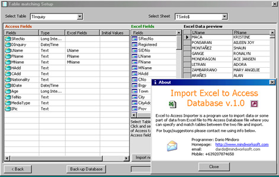



## Import Excel Data to Access Database

### Description

This program can able to import data from Excel Document to Ms Access Database file, the user will just select fields from the table on Access Database, and also select fields from the sheet of Excel file, the user can just drag and drop excel field to the matched field on Access database table, backing up of Access database is included in the program for data safety in case of user error. I created this program because I cannot find any program like this anyware, it took me half a day to finish this program since its a rush and that our client needs to import thier existing data from excel to the Inventory System database. If you find this program useful please vote for me, also visit my homepage www.mindworksoft.com for more free programs.
 
### More Info
 
Excel and Ms Access files

The excel file to be imported will be a standard table only, unpredictable error will occur if your excel contains graphics or charts. The user must know the password of the Access Database file.

The user should eliminate any blank rows in the excel before imporint, also headings of rows in excel cell must be in the very first rows so that it will become the field name or else the program will use F1, F2, etc... as the field name and the headings in your excel file will be included on the data.

             |
---                |---
**Submitted On**   |2005-06-27 14:46:18
**By**             |[Dario Mindoro](https://github.com/Planet-Source-Code/PSCIndex/blob/master/ByAuthor/dario-mindoro.md)
**Level**          |Advanced
**User Rating**    |4.9 (89 globes from 18 users)
**Compatibility**  |VB 6\.0
**Category**       |[Databases/ Data Access/ DAO/ ADO](https://github.com/Planet-Source-Code/PSCIndex/blob/master/ByCategory/databases-data-access-dao-ado__1-6.md)
**World**          |[Visual Basic](https://github.com/Planet-Source-Code/PSCIndex/blob/master/ByWorld/visual-basic.md)
**Archive File**   |[Import\_Exc1906266282005\.zip](https://github.com/Planet-Source-Code/dario-mindoro-import-excel-data-to-access-database__1-61372/archive/master.zip)

